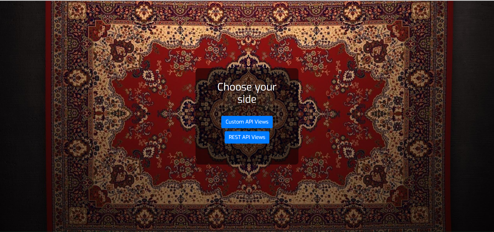

<h1 align="center">Django API Views (Custom + REST)</h1>

  

**Description:** Simple django application, with an endpoint (view) that accepts input parameters, validates them and returns the correct response.

<h4 align="center">Input parameters</h4>

**`email`** parameter must be a valid email, length no more than 100 characters. It should be checked for all forbidden characters, combinations of characters, etc. `gmail.com` and `icloud.com` in this project considered as not valid email host.

**`password`** parameter - the password must consist of alphanumeric characters, underscore, starts with an capital letter. Length from 7 to 16 characters.

**`first_name`** - only letters and dashes.

**`last_name`** - only letters, dash and space.

### 📝 &nbsp;Requirements

- **Django** == `3.2.6`
- **Python** == `3.8.6`
- **django-crispy-forms** == `1.12.0`
- **django-extensions** == `3.1.3`
- **djangorestframework** == `3.12.4`
- **dnspython** == `2.1.0`
- **PyJWT** == `1.7.1`
- **python-decouple** == `3.4`

### 📷 Part 1 (with screenshots)

This part includes the implementation of our main task (see Description) and a separate endpoint that will display request records filtered by the current IP address (where the request came from).

The implementation of this part is in folder `api/` and accordingly on url `../api/v1/get/` and `../api/v1/post/`.

`../api/v1/post/` - contains the implementation of the main task.

`../api/v1/get/`-  display request records filtered by the current IP address.

Parameters Validation (Postman)
:-------------------------:

### 📷 Part 2 (with screenshots)

This part expands our task by including what was covered in the previous paragraph via RESTful implementation.

The implementation of this part is in folder `rest/`.

`POST` request -  implementation of the main task.

`GET` request - display request records filtered by the current IP address.

Parameters Validation        |  Valid Parameters | Email must be Unique
:-------------------------:|:-------------------------:|:-------------------------:
 ||

Valid Parameters (Postman) |
:-------------------------:|

### 📷 Part 3 (with screenshots)

The hardest part. Users appear in the application at the system level. Now, instead of requests, we will store users. The user himself must register through a separate endpoint (`/register/`), where the sent parameters will be checked. After registration, the user goes to the authorization endpoint (`/login/`) and a token is returned to him (`JWT`). Further, all requests are authorized through the user's token.

The implementation of this part is in folder `authentication/`.

- `authentication/register/` - allows you to register.

- `authentication/login/` - allows you to log in.

- `authentication/user-info/` - contains information about the logged in user.

**Registration of New Users** - the main logic is implemented in the `RegistrationSerializer` class and in `RegistrationAPIView`.

**User Login** - `LoginSerializer` class and `LoginAPIView`.

**Retrieving and Updating User Data** - `UserSerializer` and `UserRetrieveUpdateAPIView`.

`authentication/backends.py` - custom backend to support JWT .

Registration (Validation)        |  Successful Registration | Login (Validation)     |  Login (Wrong Password)
:-------------------------:|:-------------------------:|:-------------------------:|:-------------------------:
 || |

Successful Login        |  GET User Info (without token) | GET User Info (Success)     |  Change User Email
:-------------------------:|:-------------------------:|:-------------------------:|:-------------------------:
 || |

<h4 align="center">Main Logic</h4>

The key idea is to create our own User model instead of the Django model and write our own views to support returning JSON instead of HTML.

With token-based authentication, the server provides the client with a token after a successful login/register request. Token is generated as a simple object (dict) with two fields: `id` and `exp`, this object is encrypted using the server's `SECRET_KEY` and given to the client for further use.

The client is expected to send a token with future requests (instead of session cookies), so that the server can identify the user. We take the token from the http request, then decode the user_id from it and check if there is such a user_id in the database, and if there is such a user and is active, then the request is authorized.

### 💡 &nbsp;Additional Info

**JSON Web Token** (`JWT`) is an open standard that defines a compact and self-contained way for securely transmitting information between two parties.

Using `JWT` is a good option because it is an open standard. This means that all `JWT` implementations should be fairly similar, which is an advantage when working with different languages and technologies. `JWTs` also contain information about the user, which is convenient for the client side.
